<div align="center">


<br/>


<br/>

> **DevHub** is a full-stack Django platform where developers create public profiles, publish project case studies, collect feedback, message each other, and build a portfolio that explains the work behind the code.

<br/>

[Live Demo](https://devhub-qzke.onrender.com) •
[Features](#-features) •
[Screenshots](#-screenshots) •
[Tech Stack](#-tech-stack) •
[Project Structure](#-project-structure) •
[Installation](#-installation) •
[Workflows](#-how-devhub-works)

</div>

---

## ✨ Overview

DevHub is designed around one simple idea: a developer portfolio should show more than a title and a screenshot.

Instead of only listing projects, DevHub gives every build a story: what the project does, which tools powered it, who created it, how people reviewed it, and how other developers can reach out.

The application includes a polished dark/light UI, authenticated account management, project publishing, custom tag handling, profile editing, inbox messaging, review voting, Cloudinary-backed uploads, SMTP email delivery, and production deployment support for Render.

---

## ✨ Features

<table>
<tr>
<td width="50%" valign="top">

### 🔐 Authentication & Account

- User registration with Django auth
- Case-insensitive email & username uniqueness validation
- Login, logout, and protected routes
- Redirect back to requested pages after login
- Profile auto-creation through Django signals
- Styled account dashboard
- Edit profile, avatar, bio, socials, location, and intro
- Add, edit, and delete skills from your profile
- Add, edit, and delete projects linked to your account
- Delete account with exact username confirmation
- Profile deletion also removes the connected auth user

</td>
<td width="50%" valign="top">

### 👤 Developer Profiles

- Public developer cards on the landing page
- Search developers by name, role, or skill
- Paginated developer directory
- Personal profile page with avatar, stats, socials, skills, and projects
- Separate account view for the logged-in owner
- Profile image fallback for local static defaults and Cloudinary uploads
- Skill descriptions separated from simple skill chips

</td>
</tr>
<tr>
<td width="50%" valign="top">

### 🚀 Projects

- Project catalog with search and pagination
- Featured project spotlight based on rating and vote count
- Create, edit, and delete projects
- Project cover image upload with live preview
- Restore project image and project information on update
- Demo link and source code link support
- Project detail page with image modal, Tech Stack, sharing, and copy-link actions
- Developer reviews and ratings on projects
- Static default image fallback when no upload exists
- Projects stay visible if developer account is deleted

</td>
<td width="50%" valign="top">

### 🏷 Tags & Stack System

- Approved public tags shown as checkbox options
- Admin can approve tags from Django admin
- Users can add custom project-only tags
- Case-insensitive duplicate protection for custom tags
- Existing tags are reused instead of duplicated
- Tags can remain private to one project until approved
- Empty states show "Stack not specified" instead of broken UI

</td>
</tr>
<tr>
<td width="50%" valign="top">

### 💬 Messaging

- Send messages to developers from profile pages
- Guests can send optional name/email/subject
- Authenticated users send as their DevHub profile
- Inbox page with read/unread state
- Navbar unread message badge
- Full message view with sender, recipient, time, and preserved line breaks
- Sender profile links when available

</td>
<td width="50%" valign="top">

### ⭐ Feedback & Reviews

- Logged-in users can review projects
- Positive/needs-improvement voting
- Optional written comments
- One review per user per project
- Owners cannot review their own projects
- Review totals update project rating
- Reviews stay visible if reviewer profile is deleted
- Comments show relative time with a custom template filter

</td>
</tr>
<tr>
<td width="50%" valign="top">

### 📧 Email & Password Reset

- Styled welcome email after registration
- Password reset via a secure link sent to your email
- Custom password reset request, sent, confirmation, and completion pages
- Custom HTML and text email templates
- Gmail SMTP app-password configuration
- `SITE_URL` support for production links

</td>
<td width="50%" valign="top">

### 🎨 UI & Experience

- Custom dark/light theme toggle
- Responsive navbar and mobile menu
- Animated reveal-on-scroll effects
- Interactive hero tilt effect
- Glassmorphism cards and gradient call-to-action buttons
- Flash messages with auto-dismiss
- Accessible labels and semantic page structure
- Custom forms for auth, projects, skills, messages, and account deletion

</td>
</tr>
</table>

---

## 🎯 Core Idea

```text
Developer creates profile
        ->
Redirected to complete his/her own profile — role, bio, socials, location and avatar
        ->
Add skills, Publishes projects with stack, links, image, and story
        ->
Other developers search, review, message, and discover the work
```

DevHub is not just a portfolio viewer. It is a proof-of-work network for developers who want their projects to explain their thinking.

---

## 👁 Guest vs Account Access

| Action                                 | Guest                             | Account Required |
| -------------------------------------- | --------------------------------- | ---------------- |
| Browse the developer directory         | ✅                                | ✅               |
| View any developer's full profile      | ✅                                | ✅               |
| Browse the project catalog             | ✅                                | ✅               |
| View full project details              | ✅                                | ✅               |
| Send a message to a developer          | ✅ _(with optional name & email)_ | ✅               |
| Edit profile, avatar, bio, and socials |                                   | ✅               |
| Add and manage skills                  |                                   | ✅               |
| Create, edit, and delete projects      |                                   | ✅               |
| Leave a review on a project            |                                   | ✅               |
| Access your inbox and read messages    |                                   | ✅               |
| Delete your account                    |                                   | ✅               |

---

## 🖼 Screenshots

| Page                 | Preview                                                 |
| -------------------- | ------------------------------------------------------- |
| Landing / Developers | 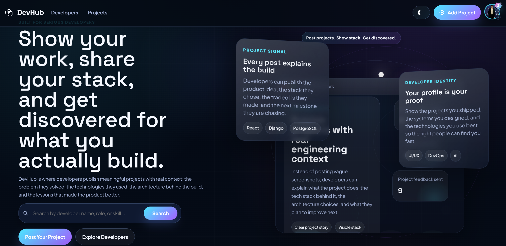            |
| Register             | 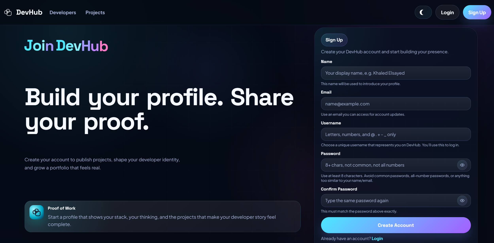                   |
| Login                | 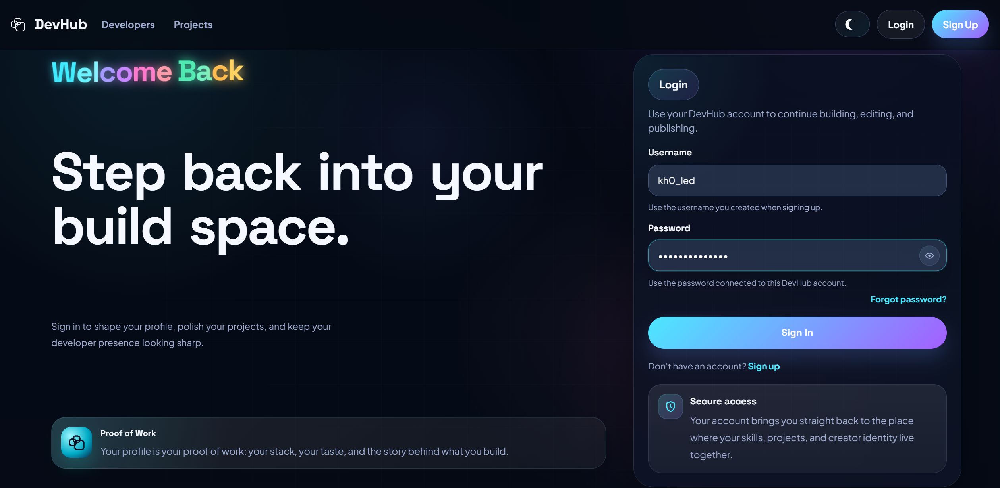                         |
| Edit Profile         |            |
| Account Dashboard    |  |
| Delete Account       | 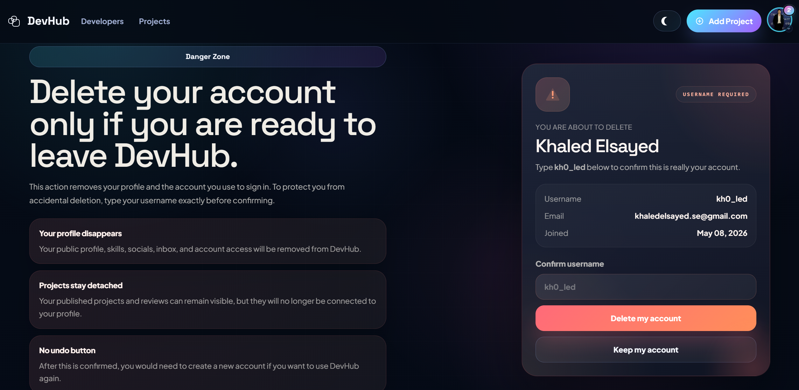       |
| Projects Catalog     |    |
| Project Detail       |        |
| Project Form         |            |
| Delete Project       | 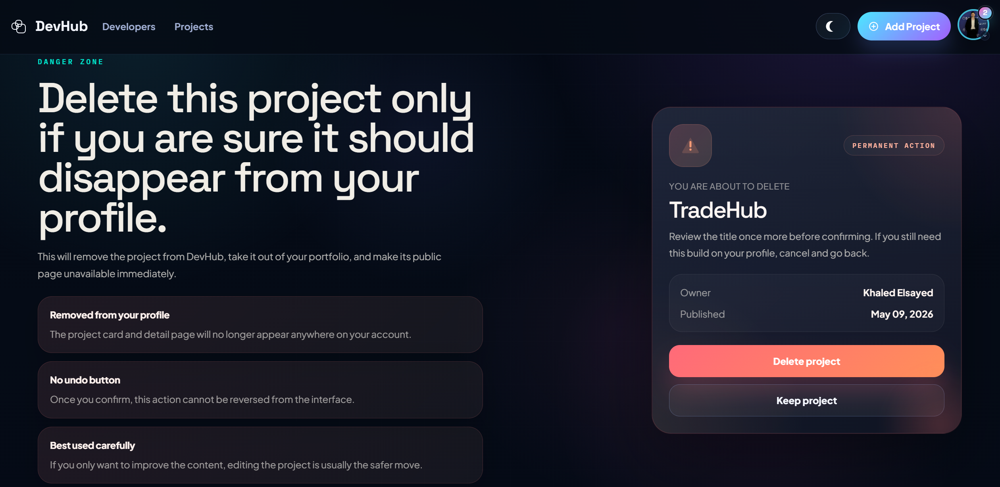       |
| Send Message         | 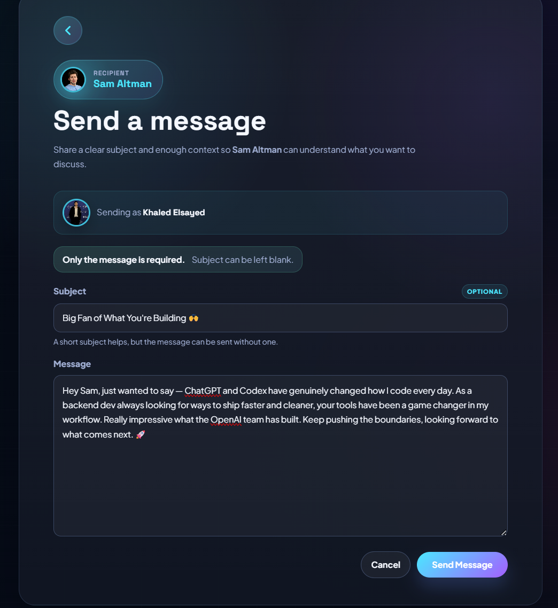           |
| Inbox                | 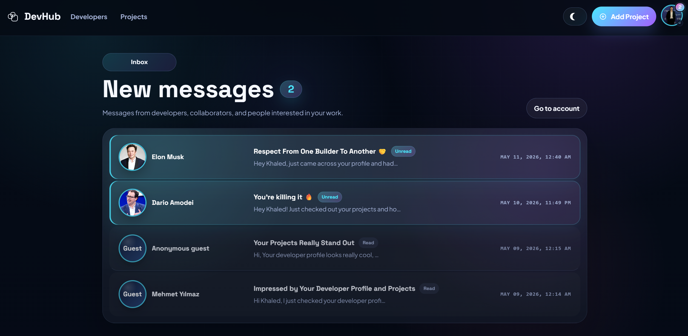                         |
| Full Message         | 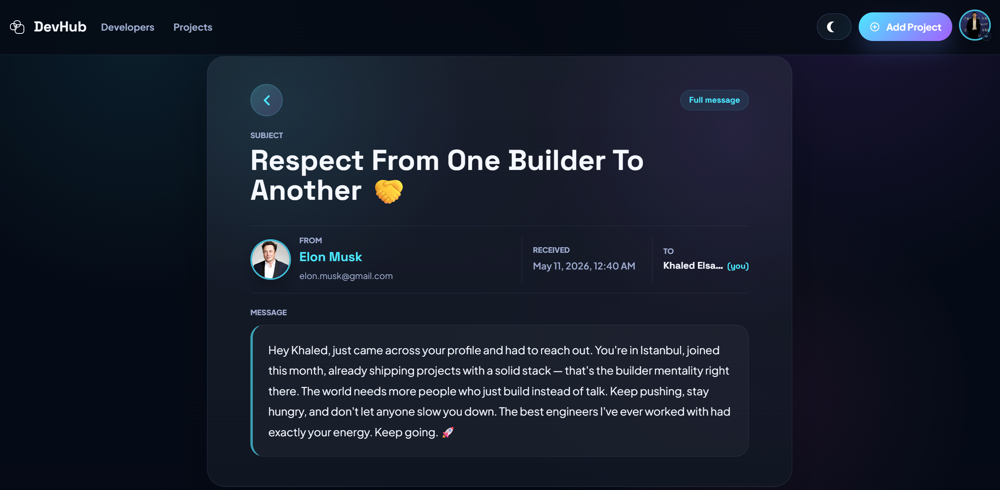         |
| Password Reset       | 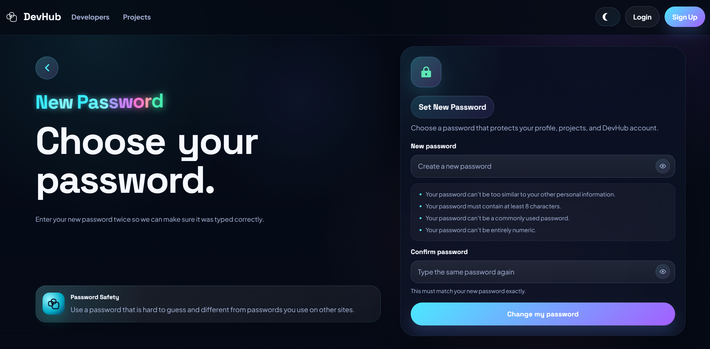       |
| Reset Email          | 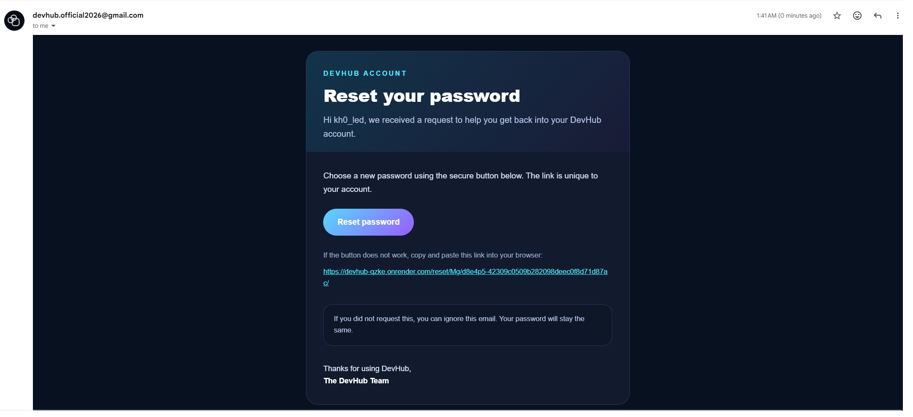             |
| Welcome Email        | 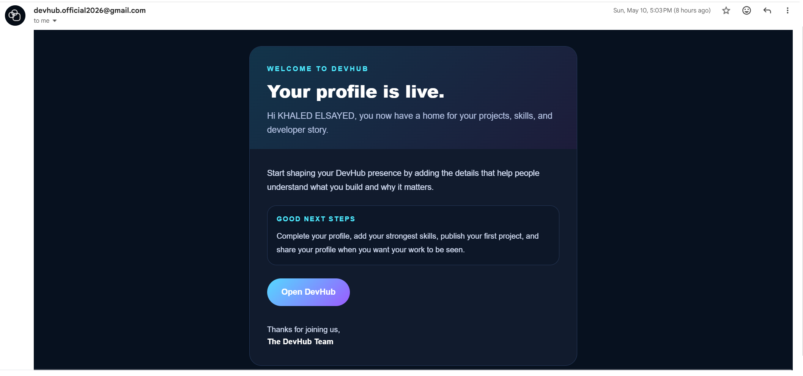         |

---

## ⚙ Tech Stack

| Layer         | Technology                                    | Purpose                                                              |
| ------------- | --------------------------------------------- | -------------------------------------------------------------------- |
| Language      | Python 3.11+                                  | Backend language                                                     |
| Framework     | Django 5.2.12                                 | Web framework, auth, routing, templates, ORM                         |
| Database      | PostgreSQL / SQLite                           | Production database through `DATABASE_URL`, local development option |
| Media Storage | Cloudinary                                    | User-uploaded avatars and project images                             |
| Static Files  | WhiteNoise + Django staticfiles               | CSS, JavaScript, and local default images                            |
| Server        | Gunicorn                                      | Production WSGI server                                               |
| Deployment    | Render                                        | Hosted web service and database                                      |
| Email         | Gmail SMTP                                    | Welcome emails and password reset emails                             |
| Frontend      | Django Templates, Bootstrap 5.3.3, Custom CSS | UI pages and responsive layout                                       |
| Interactions  | Vanilla JavaScript                            | Theme toggle, menu, previews, modals, share/copy actions             |
| Images        | Pillow                                        | ImageField support                                                   |
| Config        | python-dotenv, dj-database-url                | Environment-based settings                                           |

---

## 🧱 Data Model

| Model     | App        | What It Stores                                                   |
| --------- | ---------- | ---------------------------------------------------------------- |
| `Profile` | `users`    | Public developer identity, avatar, bio, socials, location, intro |
| `Skill`   | `users`    | Developer skills with optional explanation                       |
| `Message` | `users`    | Inbox messages between developers or from guests                 |
| `Project` | `projects` | Project title, story, image, links, owner, tags, vote stats      |
| `Tag`     | `projects` | Approved public tags and custom project tags                     |
| `Review`  | `projects` | Project feedback vote and optional written comment               |

Important deletion behavior:

- Deleting a `Profile` deletes the connected Django `User` through a signal.
- Projects use `on_delete=SET_NULL`, so published work can remain visible after account deletion, but the owner identity is no longer shown.
- Reviews use `on_delete=SET_NULL`, so feedback history can remain visible after reviewer deletion, but the reviewer identity is no longer shown.
- Messages keep sender/recipient relationships nullable so deleted profiles do not break message history, but the sender identity will appear as Guest.

---

## 📂 Project Structure

```text
devhub/
│
├── devhub/
│   ├── settings.py                     # Django settings, database, Cloudinary, email, static files
│   ├── urls.py                         # Root routes, password reset routes, app includes
│   ├── asgi.py
│   └── wsgi.py
│
├── users/
│   ├── models.py                       # Profile, Skill, Message
│   ├── forms.py                        # Register, profile, skill, message forms
│   ├── views.py                        # Auth, profiles, account, skills, inbox, messages
│   ├── urls.py                         # User-facing routes
│   ├── utils.py                        # Developer search and pagination
│   ├── signals.py                      # Auto profile creation, welcome email, user sync/delete
│   ├── admin.py                        # Profile, Skill, Message admin registration
│   ├── apps.py                         # Loads signals on app ready
│   │
│   └── templates/users/
│       ├── profiles.html               # Landing page and developer directory
│       ├── user-profile.html           # Public developer profile
│       ├── account.html                # Logged-in account dashboard
│       ├── profile_form.html           # Edit profile page
│       ├── skill_form.html             # Create/update skill page
│       ├── delete_skill.html           # Skill delete confirmation
│       ├── delete_account.html         # Account delete confirmation
│       ├── login.html                  # Login page
│       ├── register.html               # Registration page
│       ├── inbox.html                  # Inbox list
│       ├── message.html                # Full message page
│       ├── message_form.html           # Send message page
│       ├── reset_password.html         # Password reset request page
│       ├── reset_password_sent.html    # Password reset sent page
│       ├── reset_password_confirm.html # New password page
│       ├── reset_password_complete.html# Reset complete page
│       ├── password_reset_email.html   # HTML password reset email
│       ├── password_reset_email.txt    # Text password reset email
│       ├── password_reset_subject.txt  # Reset email subject
│       ├── welcome_email.html          # HTML welcome email
│       ├── welcome_email.txt           # Text welcome email
│       └── welcome_email_subject.txt   # Welcome email subject
│
├── projects/
│   ├── models.py                       # Project, Tag, Review
│   ├── forms.py                        # Project and review forms
│   ├── views.py                        # Project catalog, CRUD, reviews, custom tags
│   ├── urls.py                         # Project routes
│   ├── utils.py                        # Project search and pagination
│   ├── admin.py                        # Tag approval admin
|   ├── apps.py                         # App startup configuration.
│   ├── templatetags/
│   │   └── project_extras.py           # Relative time filter
│   │
│   └── templates/projects/
│       ├── projects.html               # Project listing and featured spotlight
│       ├── single-project.html         # Project detail, reviews, share, image modal
│       ├── project_form.html           # Create/update project form
│       └── delete_project.html         # Project delete confirmation
│
├── templates/
│   └── base.html                       # Global layout, navbar, theme toggle, messages, footer
│
├── static/
│   ├── styles/
│   │   ├── main.css                    # Global/auth/profile/account/message styles
│   │   └── projects.css                # Project pages and project form styles
│   ├── js/
│   │   ├── main.js                     # Theme, mobile nav, reveal effects, hero tilt
│   │   ├── project-form.js             # Project image preview/default handling
│   │   └── projects-hero.js            # Animated project stats
│   └── images/
│       ├── default.png                 # Static fallback for project images
│       └── profiles/default.png        # Static fallback for profile avatars
│
├── users/migrations/                   # User app database history
├── projects/migrations/                # Project app database history
├── screenshots/
├── manage.py
├── requirements.txt
├── Procfile                            # Render/Gunicorn start command
├── .env.example                        # Environment variable template
├── .gitignore
├── LICENSE
└── README.md
```

---

## 🚀 Installation

### 1. Clone the repository

```bash
git clone https://github.com/khaledelsayed2003/devhub.git
cd devhub
```

### 2. Create and activate a virtual environment

```bash
# Windows
python -m venv .venv
.venv\Scripts\activate

# macOS / Linux
python -m venv .venv
source .venv/bin/activate
```

### 3. Install dependencies

```bash
pip install -r requirements.txt
```

### 4. Create your environment file

```bash
cp .env.example .env
```

Then update `.env` with your real values.

For quick local SQLite development, you can use:

```env
DATABASE_URL=sqlite:///db.sqlite3
DEBUG=True
ALLOWED_HOSTS=localhost,127.0.0.1
CSRF_TRUSTED_ORIGINS=http://127.0.0.1:8000,http://localhost:8000
SITE_URL=http://127.0.0.1:8000
```

### 5. Run migrations

```bash
python manage.py migrate
```

### 6. Create an admin user

```bash
python manage.py createsuperuser
```

### 7. Start the development server

```bash
python manage.py runserver
```

Open:

```text
http://127.0.0.1:8000
```

---

## 🔑 Environment Variables

| Variable                | Required        | Purpose                               |
| ----------------------- | --------------- | ------------------------------------- |
| `SECRET_KEY`            | Yes             | Django secret key                     |
| `DEBUG`                 | Yes             | `True` locally, `False` in production |
| `DATABASE_URL`          | Yes             | Database connection string            |
| `ALLOWED_HOSTS`         | Yes             | Comma-separated allowed hosts         |
| `CSRF_TRUSTED_ORIGINS`  | Yes             | Trusted origins for CSRF protection   |
| `SITE_URL`              | Yes for emails  | Base URL used in email templates      |
| `EMAIL_HOST_USER`       | Yes for email   | Gmail address used to send emails     |
| `EMAIL_HOST_PASSWORD`   | Yes for email   | Gmail app password                    |
| `CLOUDINARY_CLOUD_NAME` | Yes for uploads | Cloudinary cloud name                 |
| `CLOUDINARY_API_KEY`    | Yes for uploads | Cloudinary API key                    |
| `CLOUDINARY_API_SECRET` | Yes for uploads | Cloudinary API secret                 |

---

## 🧠 How DevHub Works

### Account Creation

```text
1. User submits the registration form.
2. Django validates unique username, password, and unique email.
3. User is saved.
4. post_save signal creates a matching Profile.
5. Welcome email is rendered from text + HTML templates.
6. User is logged in and redirected to complete the profile.
```

### Developer Discovery

```text
1. Visitor lands on the developers page.
2. Profiles are filtered by name, short intro, or skill.
3. Staff and superusers are excluded from public directory results.
4. Results are ordered by newest profile first.
5. Pagination shows 3 developer cards per page.
```

### Project Publishing

```text
1. Authenticated user opens the project form.
2. User adds title, image, story, links, approved tags, and optional custom tags.
3. ProjectForm saves the main project fields.
4. form.save_m2m() saves selected approved tags.
5. Custom tags are parsed from the textarea.
6. Existing tags are reused case-insensitively.
7. New custom tags are created as unapproved.
8. Project redirects back to the catalog anchored to the new card.
```

### Custom Tag Protection

```text
1. User writes custom tags separated by commas or spaces.
2. The backend normalizes names with casefold().
3. Duplicate submitted tags are ignored or rejected.
4. Tags already selected for the project raise a form error.
5. Tags with different casing, such as Python and python, resolve to one tag.
```

### Project Feedback

```text
1. Logged-in visitor opens a project detail page.
2. Owners cannot review their own project.
3. Users who already reviewed cannot submit another review.
4. Review vote and optional body are saved.
5. Project vote ratio and total vote count are recalculated.
6. Comments appear in the project detail page with relative timestamps.
```

### Messaging

```text
1. Visitor opens a developer profile.
2. Visitor clicks Send Message.
3. Authenticated senders are attached to their Profile.
4. Guests can optionally provide name and email.
5. Message is saved to the recipient inbox.
6. Unread count appears in the navbar and inbox.
7. Opening a message marks it as read.
```

### Password Reset

```text
1. User enters their account email.
2. Django sends a secure token link using custom templates.
3. User opens the reset link.
4. Valid tokens show the new password form.
5. Invalid or expired tokens show a recovery message.
6. Password is updated and the user returns to login.
```

### Account Deletion

```text
1. Logged-in user opens the danger zone.
2. User must type their exact username.
3. Wrong username keeps the account and shows an error.
4. Correct username logs the user out.
5. Profile is deleted.
6. post_delete signal deletes the connected Django User.
7. Projects and reviews remain visible with detached ownership.
```

---

## 🧭 Main Routes

| Route                            | Name                      | Purpose                                      |
| -------------------------------- | ------------------------- | -------------------------------------------- |
| `/`                              | `profiles`                | Landing page and developer directory         |
| `/login/`                        | `login`                   | Login page                                   |
| `/register/`                     | `register`                | Sign up page                                 |
| `/logout/`                       | `logout`                  | Logout action                                |
| `/profile/<pk>/`                 | `user-profile`            | Public developer profile or own account view |
| `/account/`                      | `account`                 | Logged-in account dashboard                  |
| `/edit-account/`                 | `edit-account`            | Edit profile                                 |
| `/delete-account/`               | `delete-account`          | Delete account confirmation                  |
| `/create-skill/`                 | `create-skill`            | Add skill                                    |
| `/update-skill/<pk>/`            | `update-skill`            | Edit skill                                   |
| `/delete-skill/<pk>/`            | `delete-skill`            | Delete skill                                 |
| `/inbox/`                        | `inbox`                   | Message inbox                                |
| `/message/<pk>/`                 | `message`                 | Full message view                            |
| `/create-message/<pk>/`          | `create-message`          | Send message to developer                    |
| `/projects/`                     | `projects`                | Project catalog                              |
| `/projects/project/<pk>/`        | `project`                 | Project detail                               |
| `/projects/create-project/`      | `create-project`          | Create project                               |
| `/projects/update-project/<pk>/` | `update-project`          | Edit project                                 |
| `/projects/delete-project/<pk>/` | `delete-project`          | Delete project                               |
| `/reset-password/`               | `reset_password`          | Request reset email                          |
| `/reset-password-sent/`          | `password_reset_done`     | Reset email sent page                        |
| `/reset/<uidb64>/<token>/`       | `password_reset_confirm`  | Set new password                             |
| `/reset-password-complete/`      | `password_reset_complete` | Reset complete page                          |

---

## 🛠 Admin Features

Django admin is used for content and platform management:

- View and manage profiles
- View and manage messages
- View and manage projects
- View and manage reviews
- Approve public project tags
- Search tags by name
- Filter tags by approval status and creation date

Custom tags created by users start as unapproved. Once an admin approves them, they become available as public checkbox options in the project form.

---

## 🌐 Deployment Notes

This project is prepared for Render-style deployment:

```text
web: gunicorn devhub.wsgi:application
```

Recommended production environment:

```env
DEBUG=False
DATABASE_URL=your-render-internal-postgres-url
ALLOWED_HOSTS=your-domain.onrender.com
CSRF_TRUSTED_ORIGINS=https://your-domain.onrender.com
SITE_URL=https://your-domain.onrender.com
EMAIL_HOST_USER=your-gmail-address
EMAIL_HOST_PASSWORD=your-gmail-app-password
CLOUDINARY_CLOUD_NAME=your-cloud-name
CLOUDINARY_API_KEY=your-api-key
CLOUDINARY_API_SECRET=your-api-secret
```

Recommended build steps:

```bash
pip install -r requirements.txt
python manage.py collectstatic --noinput
python manage.py migrate
```

Production media note:

- User-uploaded files go to Cloudinary.
- Default avatar and default project images stay in `static/images/`.
- Templates use static fallbacks for default image values so Cloudinary does not need to store default assets.

---

## 🧪 Manual Test Checklist

Use this list after changes or before a release:

- Register a new user and confirm profile auto-creation.
- Confirm welcome email is sent.
- Log in and log out.
- Edit profile image, then restore default image.
- Add, update, and delete a skill.
- Create a project with approved tags.
- Create a project with custom tags.
- Try duplicate custom tags with different casing.
- Update project image, then restore default image.
- Leave a review from another account.
- Confirm owner cannot review their own project.
- Send a message as a guest.
- Send a message as an authenticated user.
- Confirm unread message badge appears in navbar.
- Open a message and confirm it becomes read.
- Request a password reset email.
- Complete password reset with a valid token.
- Delete account only after typing the exact username.

---

## 🧑‍💻 Author

<div align="center">

**Khaled Elsayed**

[](https://github.com/khaledelsayed2003)
[](https://www.linkedin.com/in/khaledelsayed2003/)
[](mailto:khaledelsayed.se@gmail.com)

</div>

---

## 📄 License

This project is licensed under the **MIT License**.

See [LICENSE](LICENSE) for details.

---

<div align="center">

### If DevHub helped inspire your next portfolio, consider giving the repo a star.


</div>
